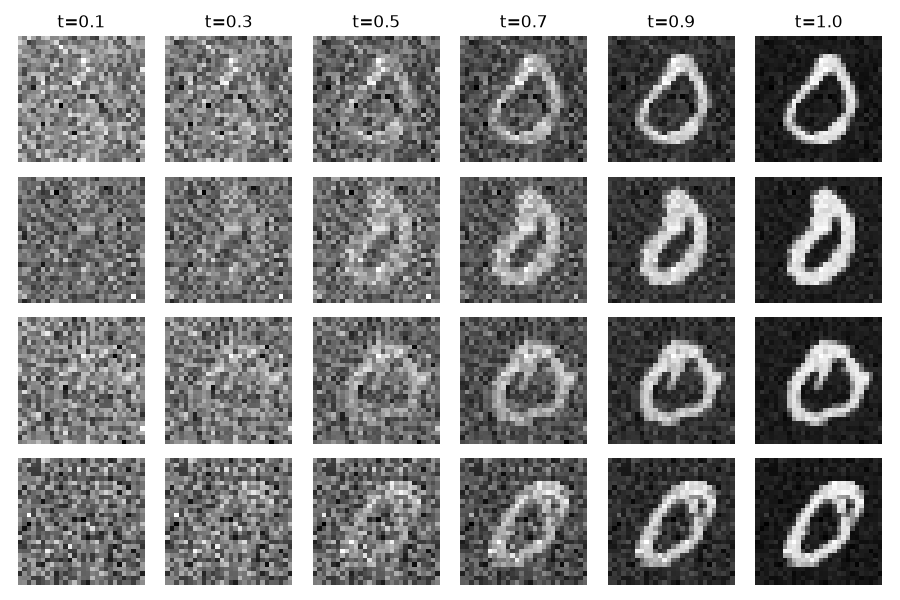
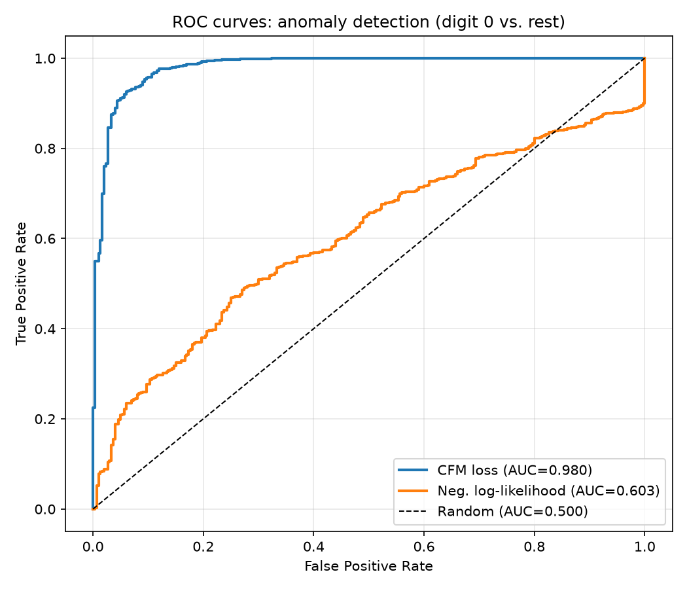
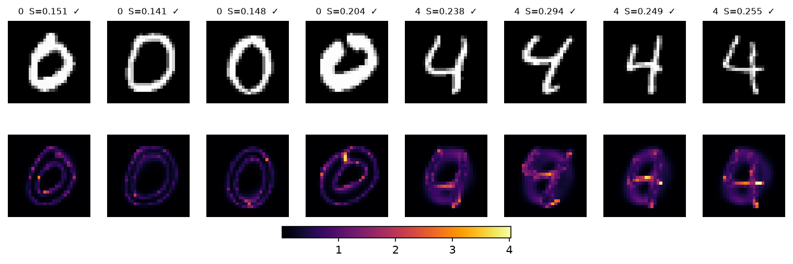

# Flow Matching Anomaly Detection

Conditional flow matching implemented from its mathematical formulation to a
working generative model, and used for one-class anomaly detection on MNIST
(digit 0 as the normal class, all other digits as anomalies). Two scores are
compared: the negative log-density under the learned model performs close to random
guessing, while reusing the conditional flow matching objective itself reaches
an AUC of 0.985.

More detailed documentation: [Exploring_Flow_Matching_and_Anomaly_Detection.pdf](Exploring_Flow_Matching_and_Anomaly_Detection.pdf)

## Results






## Usage

Install the dependencies, then run the scripts from the repository root.
MNIST downloads automatically on first run.

```bash
pip install -r requirements.txt

python -m experiments.train_unet      # trains the U-Net, writes checkpoints/
python -m experiments.test_anomalies  # per-digit scores and thresholds
python -m experiments.evaluate_roc    # ROC curves and AUC
python -m experiments.sweep_time      # AUC as a function of the flow time t
python -m visualization.plots         # samples, trajectories, score maps
```

All hyperparameters are collected in `config.py`.